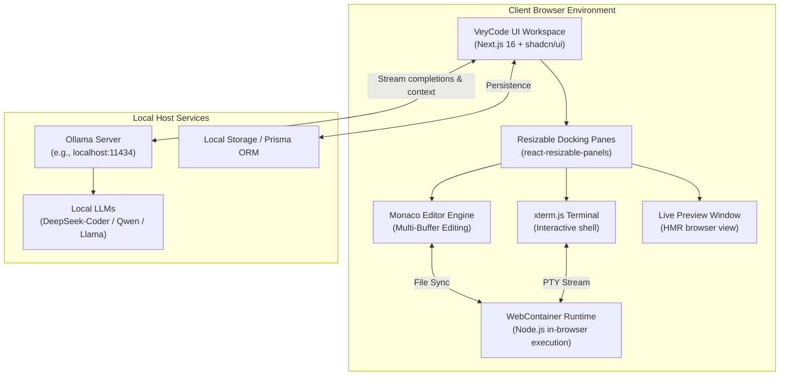

<div align="center">

<!-- Uncomment and update path once official branding asset is added:

-->

# VeyCode

### Local-First AI Web IDE

```text
Build. Run. Ask AI. Stay local.
```

An open-source, local-first browser IDE engineering environment designed to execute code in-browser while orchestrating local AI models without routing your codebase through cloud intermediaries.

<br/>

[](https://github.com/ggauravky/VeyCode)
[](https://nextjs.org/)
[](https://react.dev/)
[](https://www.typescriptlang.org/)
[](https://tailwindcss.com/)
[](https://ui.shadcn.com/)
[](https://www.prisma.io/)

</div>

---

> 🚧 **Under Active Development**
>
> VeyCode is actively being built. Core IDE scaffolding, design system primitives, and foundational architecture are in place, with browser runtime sandboxing and local AI orchestration actively under implementation.

---

## ⚡ Overview

**VeyCode** is an upcoming local-first AI web development environment. It combines a modern browser-based editor layout, isolated runtime execution, and direct integration with locally hosted Large Language Models (via Ollama) — ensuring that your proprietary source code, prompts, and workspace state never leave your machine.

- **Zero Cloud Dependence** — AI inference is performed locally via your Ollama server.
- **Client-Side Execution** — Workspaces are designed to run in sandboxed browser environments.
- **Design-First Architecture** — Powered by Next.js 16, React 19, Tailwind CSS v4, and shadcn/ui.

---

## ⚙️ How It Works

VeyCode bridges a responsive browser UI workspace with local execution engines and local LLM backends:



---

## 🛠️ Tech Stack

### Implemented Core Foundation
| Layer | Technology | Details |
| :--- | :--- | :--- |
| **Framework** | [Next.js 16](https://nextjs.org/) | App Router, Server Components & React 19 architecture |
| **Language** | [TypeScript 5](https://www.typescriptlang.org/) | Strict type checking and unified interface schemas |
| **Styling** | [Tailwind CSS v4](https://tailwindcss.com/) | Modern CSS engine with `@theme` token definitions and OKLCH color spaces |
| **UI Primitives** | [shadcn/ui](https://ui.shadcn.com/) | `base-luma` design system built with Radix & Base UI components |
| **Icons** | [Lucide React](https://lucide.dev/) | Consistent, clean icon library |
| **Layout** | [react-resizable-panels](https://github.com/bvaughn/react-resizable-panels) | Configurable, split-pane IDE workspace layouts |
| **Data Layer** | [Prisma](https://www.prisma.io/) | Modern database toolchain and schema management |

### Target Runtime & AI Architecture
| Module | Target Technology | Status |
| :--- | :--- | :--- |
| **Code Editor** | Monaco Editor | 🚧 In Development |
| **Execution Runtime** | WebContainers (Node.js in Browser) | 🚧 In Development |
| **Terminal Emulator** | xterm.js + PTY addons | 🚧 In Development |
| **Local AI Engine** | Ollama Local API | 🚧 In Development |

---

## ✨ Features

- 🎨 **Adaptive IDE Workspace Layout** — Flexible split-pane interface powered by `react-resizable-panels` with comprehensive dark/light color schemes.
- 🧩 **Comprehensive Design Token System** — Over 50+ preconfigured UI components using shadcn/ui, OKLCH palettes, and accessible primitives.
- 💻 **Monaco-Powered Editor** `🚧 In Development` — Full-featured code editing with syntax highlighting, auto-completion, multi-cursor, and diagnostics.
- ⚡ **In-Browser Runtime Engine** `🚧 In Development` — Client-side Node.js execution sandbox enabling package installation and server execution without remote cloud VMs.
- 📟 **Integrated Terminal** `🚧 In Development` — Full interactive terminal emulation with shell execution and real-time process output streaming.
- 🦙 **Local LLM Orchestration** `🚧 In Development` — Context-aware AI code generation, explanations, and refactoring via local Ollama instances.
- 📁 **Virtual Workspace Explorer** `🚧 In Development` — File tree management, dynamic buffer loading, and project structure manipulation.
- 🔒 **Privacy-First Data Flow** — No tracking, telemetry lock-in, or remote transmission of your source code.

---

## 🖥️ Preview

> 🚧 **Preview Coming Soon**
>
> Product screenshots, UI captures, and demonstration videos will be added as the VeyCode IDE workspace reaches its first milestone.

---

## 🚀 Quick Start

### Prerequisites

- [Node.js](https://nodejs.org/) (version 20.x or higher recommended)
- [npm](https://www.npmjs.com/), [pnpm](https://pnpm.io/), or [yarn](https://yarnpkg.com/)
- Optional: [Ollama](https://ollama.ai/) installed locally for AI capabilities

### 1. Clone the Repository

```bash
git clone https://github.com/ggauravky/VeyCode.git
cd VeyCode
```

### 2. Install Dependencies

```bash
npm install
```

### 3. Start the Development Server

```bash
npm run dev
```

Open [http://localhost:3000](http://localhost:3000) in your browser to inspect the application.

---

## ⚙️ Environment Configuration

When configured for local AI and persistence, VeyCode reads environment parameters from `.env.local`:

```env
# Local AI Provider (Ollama)
OLLAMA_BASE_URL=http://localhost:11434
OLLAMA_MODEL=deepseek-coder:6.7b

# Application & Auth (Planned)
NEXTAUTH_SECRET=
DATABASE_URL="file:./dev.db"
```

---

## 🗺️ Roadmap

- [x] **Milestone 1 — Architecture & Design System Foundation**
  - [x] Next.js 16 + React 19 App Router setup
  - [x] Tailwind CSS v4 tokenized styling system (OKLCH color spectrum)
  - [x] Complete shadcn/ui component primitive library
  - [x] Resizable panel workspace scaffolding
- [ ] **Milestone 2 — Editor & Workspace Management**
  - [ ] Monaco Editor integration with multi-tab buffer management
  - [ ] Tree-view file explorer with CRUD file operations
  - [ ] Command palette (`cmdk`) shortcut system
- [ ] **Milestone 3 — Browser Runtime & Terminal Sandbox**
  - [ ] WebContainer API initialization and lifecycle management
  - [ ] xterm.js interactive terminal with bidirectional process I/O
  - [ ] Live embedded preview iframe with automatic port detection
- [ ] **Milestone 4 — Local AI Engine Integration**
  - [ ] Ollama streaming API client integration
  - [ ] Workspace context extraction for prompt augmentation
  - [ ] Inline code diff suggestions and conversational sidebar assistant
- [ ] **Milestone 5 — Project Starter Templates**
  - [ ] Ready-to-use project scaffolds (React, Next.js, Express, Hono)

---

## 🤝 Contributing

Contributions, feature suggestions, and architectural feedback are welcome as VeyCode evolves.

1. Fork the repository
2. Create your feature branch (`git checkout -b feature/amazing-feature`)
3. Commit your changes (`git commit -m "feat: add amazing feature"`)
4. Push to the branch (`git push origin feature/amazing-feature`)
5. Open a Pull Request

---

## 📄 License

This project is currently distributed as open source. Specific licensing terms will be updated as the project nears its initial public release.
